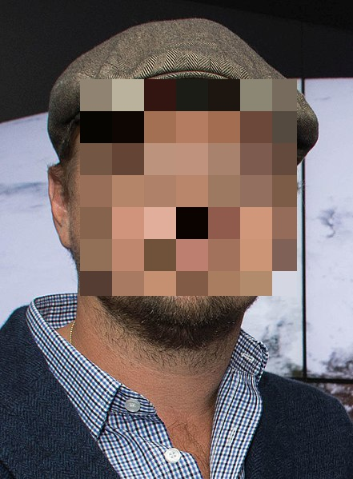

# face-privacy-filter
A model for face detection and suppression.

## Image Analysis for Face-based Privacy Filtering
This source code creates and pushes a model into Cognita that processes
incoming images and outputs a detected faces as well as the original image
input (if configured that way).  The model uses a [python interface](https://pypi.python.org/pypi/opencv-python)
to the [OpenCV library](https://opencv.org/) to detect faces and perform
subsequent image processing.  This module does not support training
at this time and instead uses a pre-trained face cascade, which is
included (from OpenCV) in this module.

### Usage
This package contains runable scripts for command-line evaluation,
packaging of a model (both dump and posting), and simple web-test
uses.   All functionality is encapsulsted in the `filter_image.py`
script and has the following arguments.

```
usage: run_face-privacy-filter_reference.py [-h] [-p PREDICT_PATH] [-i INPUT]
                                            [-c] [-s] [-f {detect,pixelate}]
                                            [-a PUSH_ADDRESS] [-d DUMP_MODEL]

optional arguments:
  -h, --help            show this help message and exit
  -p PREDICT_PATH, --predict_path PREDICT_PATH
                        save detections from model (model must be provided via
                        'dump_model')
  -i INPUT, --input INPUT
                        absolute path to input data (image or csv, only during
                        prediction / dump)
  -c, --csv_input       input as CSV format not an image
  -s, --suppress_image  do not create an extra row for a returned image
  -f {detect,pixelate}, --function {detect,pixelate}
                        which type of model to generate
  -a PUSH_ADDRESS, --push_address PUSH_ADDRESS
                        server address to push the model (e.g.
                        http://localhost:8887/v2/models)
  -d DUMP_MODEL, --dump_model DUMP_MODEL
                        dump model to a pickle directory for local running
```


### Examples
This single repo has a number of different models that can be
composed together for operation.

* Dump the `detect` model to disk.
```
./bin/run_local.sh -d model_detect -f detect
```
* Dump the `pixelate` model to disk.
```
./bin/run_local.sh -d model_pix -f pixelate
```
* Evaluate the `detect` model from disk and a previously produced detect object
```
./bin/run_local.sh -d model_detect -p output.csv -i web_demo/images/face_DiCaprio.jpg
```
* Example for evaluating the `pixelate` model from disk and a previously produced detect object
```
./bin/run_local.sh -d model_pix -i detect.csv -p output.jpg --csv_input
```


## Face-based Use Cases
This project includes a number of face-based use cases including raw
detection, blurring, and other image-based modifications based on
detected image regions.

* **Face Detection Use-case** - This source code creates and pushes a model that processes
incoming images and outputs detected faces.

# Example Interface
An instance should first be built and downloaded and then
launched locally.  Afterwards, the sample application found in 
[web_demo](web_demo) uses a `localhost` service to classify
and visualize the results of image classification.

* [DiCaprio celebrity face sample](web_demo/images/face_DiCaprio.jpg) ([wikimedia source](https://en.wikipedia.org/wiki/Celebrity#/media/File:Leonardo_DiCaprio_visited_Goddard_Saturday_to_discuss_Earth_science_with_Piers_Sellers_(26105091624)_cropped.jpg))
* [Schwarzenegger celebrity face sample](web_demo/images/face_Schwarzenegger.jpg) ([wikimedia source](https://upload.wikimedia.org/wikipedia/commons/thumb/0/0f/A._Schwarzenegger.jpg/220px-A._Schwarzenegger.jpg))
* [Commercial example](web_demo/images/commercial.jpg) ([youtube source](https://www.youtube.com/watch?v=34KfCNapnUg))


before  | after
------- | -------
  | 
  | 
