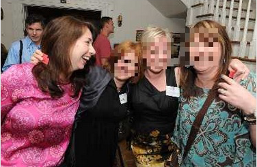

.. ===============LICENSE_START=======================================================
.. Acumos CC-BY-4.0
.. ===================================================================================
.. Copyright (C) 2017-2018 AT&T Intellectual Property & Tech Mahindra. All rights reserved.
.. ===================================================================================
.. This Acumos documentation file is distributed by AT&T and Tech Mahindra
.. under the Creative Commons Attribution 4.0 International License (the "License");
.. you may not use this file except in compliance with the License.
.. You may obtain a copy of the License at
..
..      http://creativecommons.org/licenses/by/4.0
..
.. This file is distributed on an "AS IS" BASIS,
.. WITHOUT WARRANTIES OR CONDITIONS OF ANY KIND, either express or implied.
.. See the License for the specific language governing permissions and
.. limitations under the License.
.. ===============LICENSE_END=========================================================

.. _face_privacy:

|Build Status|

=========================
Face Privacy Filter Guide
=========================

This model contains the capability to generate two submodels: one for
face detection and one for face suppression through pixelation.

A model example for face detection from images within Acumos.

Background
==========

This model analyzes static images to detect frontal faces. It utilizes a
frontal face cascade from the `OpenCV <https://opencv.org/>`__ image
processing library. Model load time is optimized by creating and
maintaining the fixed cascade in memory while operating. Demonstrating
the capability of custom classes and requisite member variables, the
cascade is serialized with the model as a string asset which is
deserialized and loaded from disk upon startup.

.. _face_privacy_usage:

Usage
-----

Input to the model is an array of one or more tuples of image binary
data and a binary mime type. The position of the image within the array
is utilized in the output signature as a zero-based index. For example
if three images were sent, the output probabilities would have 0, 1, and
2 as index values. The output from this model is a repeated array of
detected regions for each face in each input image. So that image data
can be cascaded to other models, the original image and mime type are
also embedded with the special region code ``-1`` within the output.

A web demo is included with the source code, available via the
`Acumos Gerrit repository <https://gerrit.acumos.org/r/gitweb?p=face-privacy-filter.git;a=summary>`__
or the mirrored `Acumos Github repository <https://github.com/acumos/face-privacy-filter>`__. It
utilizes a protobuf javascript library and processes input images to
detect all faces within an image.

Once deployed, you can quickly jump to the
`default webhost page <http://htmlpreview.github.io/?https://github.com/acumos/face-privacy-filter/blob/master/web_demo/face-privacy.html>`__
and point to your model for a demo; see :ref:`demonstration_face-privacy` for more details.

Performance
-----------

As this model wraps a preexisting cascade, no formal testing evaluation
was performed. However, experimental usage indicates the following
highlights.

-  Faces that are too small can easily be missed.
-  Frontal faces perform best, with some tolerance of about 5-10 degrees
   off-plane rotation.
-  Detection is fairly sensitive to rotation in plane, so try not to let
   subject faces rotate more than 15 degrees.
-  Dark or low contrast images generally do not perform well for
   detection.

More Information
----------------

As this model uses a generic cascade from OpenCV, readers can easily
substituted or update those models with no change in API endpoint
required. Additionally, secondary verification methods using pixel
validation (e.g. sub-part verification, symmetry tests, or more advanced
parts-based verifications) may dramatically improve the false alarm
rate, although the current model was tuned for precision (instead of
recall) already.

Source Installation
===================

This section is useful for source-based installations and is not
generally intended for catalog documentation.

Image Analysis for Face-based Privacy Filtering
-----------------------------------------------

This source code creates and pushes a model into Acumos that processes
incoming images and outputs a detected faces as well as the original
image input (if configured that way). The model uses a
`python interface <https://pypi.python.org/pypi/opencv-python>`__ to the
`OpenCV library <https://opencv.org/>`__ to detect faces and perform subsequent
image processing. This module does not support training at this time and
instead uses a pre-trained face cascade, which is included (from OpenCV)
in this module.

Package dependencies
--------------------

Package dependencies for the core code and testing have been flattened
into a single file for convenience. Instead of installing this package
into your your local environment, execute the command below.

**Note:** If you are using an
`anaconda-based environment <https://anaconda.org>`__, you may want to try installing
with conda first and then pip.

::

    conda install --yes --file requirements.txt  # suggested first step if you're using conda

Installation of the package requirements for a new environment.

::

    pip install -r requirements.txt

Usage
-----

This package contains runable scripts for command-line evaluation,
packaging of a model (both dump and posting), and simple web-test uses.
All functionality is encapsulsted in the ``filter_image.py`` script and
has the following arguments.

::

    usage: filter_image.py [-h] [-p PREDICT_PATH] [-i INPUT] [-c]
                           [-f {detect,pixelate}] [-s] [-a PUSH_ADDRESS]
                           [-A AUTH_ADDRESS] [-d DUMP_MODEL]

    optional arguments:
      -h, --help            show this help message and exit

    main execution and evaluation functionality:
      -p PREDICT_PATH, --predict_path PREDICT_PATH
                            save detections from model (model must be provided via
                            'dump_model')
      -i INPUT, --input INPUT
                            absolute path to input data (image or csv, only during
                            prediction / dump)
      -c, --csv_input       input as CSV format not an image
      -f {detect,pixelate}, --function {detect,pixelate}
                            which type of model to generate
      -s, --suppress_image  do not create an extra row for a returned image

    model creation and configuration options:
      -a PUSH_ADDRESS, --push_address PUSH_ADDRESS
                            server address to push the model (e.g.
                            http://localhost:8887/v2/models)
      -A AUTH_ADDRESS, --auth_address AUTH_ADDRESS
                            server address for login and push of the model (e.g.
                            http://localhost:8887/v2/auth)
      -d DUMP_MODEL, --dump_model DUMP_MODEL
                            dump model to a pickle directory for local running

Example Usages
==============

Please consult the :ref:`tutorials_face-privacy` dirctory for usage examples
including an in-place :ref:`demonstration_face-privacy`.

Face-based Use Cases
--------------------

This project includes a number of face-based use cases including raw
detection, blurring, and other image-based modifications based on
detected image regions.

-  **Face Detection Use-case** - This source code creates and pushes a
   model that processes incoming images and outputs detected faces.

Metadata Examples
=================

-  example detect catalog image - `url source <https://www.pexels.com/photo/close-up-photography-of-man-wearing-sunglasses-1212984/>`__
-  example blur catalog image - `url source <https://flic.kr/p/bEgYbs>`__

.. |Build Status| image:: https://jenkins.acumos.org/buildStatus/icon?job=face-privacy-filter-tox-verify-master
   :target: https://jenkins.acumos.org/job/face-privacy-filter-tox-verify-master/

