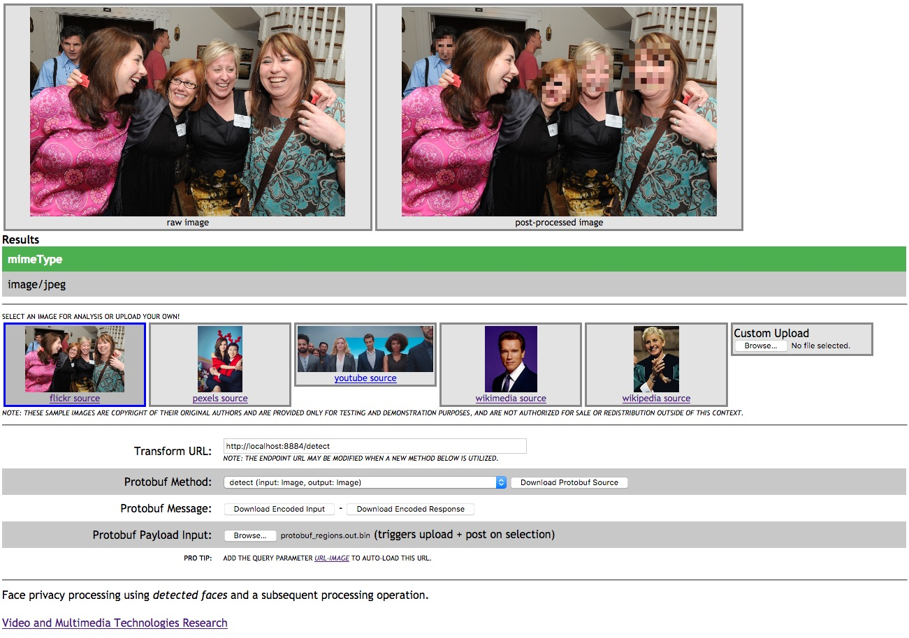

.. ===============LICENSE_START=======================================================
.. Acumos CC-BY-4.0
.. ===================================================================================
.. Copyright (C) 2017-2018 AT&T Intellectual Property & Tech Mahindra. All rights reserved.
.. ===================================================================================
.. This Acumos documentation file is distributed by AT&T and Tech Mahindra
.. under the Creative Commons Attribution 4.0 International License (the "License");
.. you may not use this file except in compliance with the License.
.. You may obtain a copy of the License at
..
..      http://creativecommons.org/licenses/by/4.0
..
.. This file is distributed on an "AS IS" BASIS,
.. WITHOUT WARRANTIES OR CONDITIONS OF ANY KIND, either express or implied.
.. See the License for the specific language governing permissions and
.. limitations under the License.
.. ===============LICENSE_END=========================================================

.. _demonstration_face-privacy:

=========================================
Demonstrations: Tutorial for Face Privacy
=========================================

Web Demo
========

This web page sample allows the user to submit an image to a face
detection and a face pixelation service in serial progression.

* ***Image Copyrights May Apply*** - the included sample videos may
carry additional copyright restrictions and are not meant for public resale or
consumption.

Browser Interaction
===================

Most browsers should have no CORS or other cross-domain objections to
dropping the file ``face-privacy.html`` into the browser and accesing a
locally hosted server API, as configured in :ref:`deployment_face-privacy`.

Open-source hosted run
-----------------------

Utilizing the generous `htmlpreview function <https://htmlpreview.github.io/>`__
available on GitHub, you
can also experiment with the respository-based web resource. This
resource will proxy the repository ``web_demo`` directory into a live
resource.

Navigate to the
`default webhost page <http://htmlpreview.github.io/?https://github.com/acumos/face-privacy-filter/blob/master/web_demo/face-privacy.html>`__
and confirm that the resource load properly. The image at the bottom of
this guide is a good reference for correct page loading and display.

After confirming correct page load, simply replace the value in the
``Transform URL`` field to point at your deployed instance. For example,
if you've created a dumped model locally, it might be a localhost port.

Local webserver run
-------------------

If you want to run the test locally, you can use the built-in python
webserver with the line below while working in the ``web_demo``
directory (assuming you're running python3).

::

    python -m http.server 5000

Afterwards, just point your browser at
``http://localhost:5000/face-privacy.html``.

Example face privacy demo (docker and protobuf)
===============================================

To customize this demo, one should change either the included javascript
or simply update the primary classification URL on the page itself
during runtime. This demo utilizes the
`javascript protobuf library <https://github.com/dcodeIO/ProtoBuf.js/>`__ to encode
parameters into proto binaries in the browser.

***NOTE*** One version of the face model's protobuf schema is
included with this web page, but it may change over time. If you receive
encoding errors or unexpected results, please verify that your target
model and this web page are using the same ``.proto`` file.

-  confirm that your target docker instance is configured and running
-  download this directory to your local machine

   -  confirm the host port and classification service URL in the file
      ``face-privacy.js``
   -  modify the ``protoDefault`` setting to be 1

      ::

          urlDefault: "http://localhost:8884/transform",

-  view the page ``face-privacy.html`` in a Crome or Firefox browser
-  you can switch between a few sample images or upload your own by
   clicking on the buttons below the main image window

Special decoding example
------------------------

In ``protobuf`` mode, you can also download a binary, encoded version of
the last image that was sent to the remote service. When available, the
Download Encoded Message button will be enabled and a binary file will
be generated in the browser.

::

    protoc --decode=HipTviKTkIkcmyuMCIAIDkeOOQQYyJne.Image model.pixelate.proto < protobuf.bin

**NOTE** The specific package name may have changed since the time of
writing, so be sure to check the contents of the current ``.proto``
file.

Example face privacy demo (HTTP parameters)
-------------------------------------------

To customize this demo, one should change either the included javascript
or simply update the primary classification URL on the page itself
during runtime.

-  confirm that your local instance is configured and running
-  download this directory to your local machine

   -  confirm the host port and classification service URL in the file
      ``face-privacy.js``
   -  modify the ``protoDefault`` setting to be 0

      ::

          urlDefault: "http://localhost:8884/transform",

-  view the page ``face-privacy.html`` in a Crome or Firefox browser
-  you can switch between a few sample images or upload your own by
   clicking on the buttons below the main image window

Example Interface
=================

An instance should first be built and downloaded and then launched
locally. Afterwards, the sample application found in the
``web_demo`` directory uses a ``localhost`` service to classify and
visualize the results of image classification.

-  Commercial example (`youtube source <https://www.youtube.com/watch?v=34KfCNapnUg>`__)
-  Reunion face sample  `flickr source <https://flic.kr/p/bEgYbs>`__)
-  family face example (`pexel source <https://www.pexels.com/photo/adult-affection-beautiful-beauty-265764/>`__)
-  DiCaprio celebrity face sample (`wikimedia source <https://en.wikipedia.org/wiki/Celebrity#/media/File:Leonardo_DiCaprio_visited_Goddard_Saturday_to_discuss_Earth_science_with_Piers_Sellers_(26105091624)_cropped.jpg>`__)
-  Schwarzenegger celebrity (`wikimedia source <https://upload.wikimedia.org/wikipedia/commons/thumb/0/0f/A._Schwarzenegger.jpg/220px-A._Schwarzenegger.jpg>`__)
-  DeGeneres celebrity face sample (`wikipedia source <https://en.wikipedia.org/wiki/Ellen_DeGeneres#/media/File:Ellen_DeGeneres-2009.jpg>`__)

