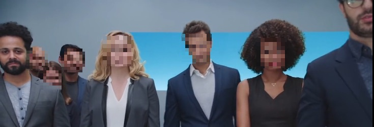
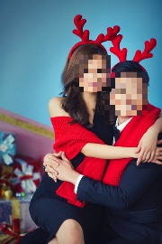

# Web Demo
This web page sample allows the user to submit an image to
an image classification and image mood classification service
in serial progression.

** Image Copyrights May Apply ** - the included sample videos may carry
additional copyrights and are not meant for public resale or consumption.

## Browser Interaction
Most browsers should have no
CORS or other cross-domain objections to dropping the file `face-privacy.html`
into the browser and accesing a locally hosted server API, as configured
in [the previous tutorial](lesson2.md).

If you want to run the test locally, you can use the built-in python
webserver with the line below while working in the `web_demo` directory.
```
python -m http.server 5000
```

Afterwards, just point your browser at `http://localhost:5000/face-privacy.html`.

## Example mood classification demo (docker and protobuf)
To customize this demo, one should change either the included javascript
or simply update the primary classification URL on the page itself during runtime.
This demo utilizes the [javascript protobuf library](https://github.com/dcodeIO/ProtoBuf.js/)
to encode parameters into proto binaries in the browser.

** NOTE ** One version of the face model's protobuf schema is included with
this web page, but it may change over time.  If you receive encoding errors
or unexpected results, please verify that your target model and this web page
are using the same `.proto` file.

* confirm that your target docker instance is configured and running
* download this directory to your local machine
    * confirm the host port and classification service URL in the file `face-privacy.js`
    * modify the `protoDefault` setting to be 1
```
urlDefault: "http://localhost:8884/transform",
```
* view the page `face-privacy.html` in a Crome or Firefox browser
* you can switch between a few sample images or upload your own by clicking on the buttons below the main image window

Example web application with blur process.

* 

### Special decoding example
In `protobuf` mode, you can also download a binary, encoded version of the last
image that was sent to the remote service.  When available, the <strong>Download Encoded Message</strong>
button will be enabled and a binary file will be generated in the browser.

```
protoc --decode=sapLzHrujUMPBGCBEMWQFxEIMsxocFrG.FaceImage model.proto < protobuf.bin
```


## Example mood classification demo (HTTP parameters)
To customize this demo, one should change either the included javascript
or simply update the primary classification URL on the page itself during runtime.

* confirm that your local instance is configured and running
* download this directory to your local machine
    * confirm the host port and classification service URL in the file `face-privacy.js`
    * modify the `protoDefault` setting to be 0
```
urlDefault: "http://localhost:8884/transform",
```
* view the page `face-privacy.html` in a Crome or Firefox browser
* you can switch between a few sample images or upload your own by clicking on the buttons below the main image window


# Example Interface
An instance should first be built and downloaded and then
launched locally.  Afterwards, the sample application found in
[web_demo](web_demo) uses a `localhost` service to classify
and visualize the results of image classification.

* [Commercial example](../../web_demo/images/commercial.jpg) ([youtube source](https://www.youtube.com/watch?v=34KfCNapnUg))
* [Reunion face sample](../../web_demo/images/face_reunion.jpg) ([flickr source](https://flic.kr/p/bEgYbs))
* [family face example](../../web_demo/images/face_family.jpg) ([pexel source](https://www.pexels.com/photo/adult-affection-beautiful-beauty-265764/))
* [DiCaprio celebrity face sample](../../web_demo/images/face_DiCaprio.jpg) ([wikimedia source](https://en.wikipedia.org/wiki/Celebrity#/media/File:Leonardo_DiCaprio_visited_Goddard_Saturday_to_discuss_Earth_science_with_Piers_Sellers_(26105091624)_cropped.jpg))
* [Schwarzenegger celebrity face sample](../../web_demo/images/face_Schwarzenegger.jpg) ([wikimedia source](https://upload.wikimedia.org/wikipedia/commons/thumb/0/0f/A._Schwarzenegger.jpg/220px-A._Schwarzenegger.jpg))


before  | after
------- | -------
  | 
  | 
