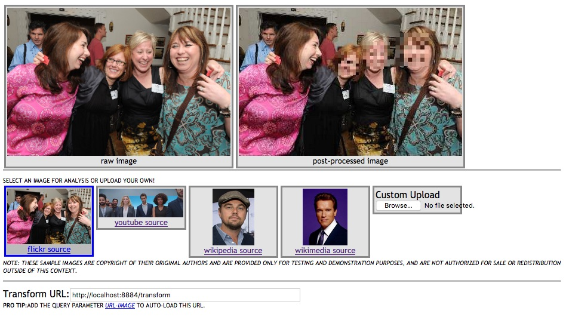

# Face Privacy Example Example
This web page sample allows the user to submit an image to
an face detect and process task.

**Image Copyrights May Apply** - the included sample videos may carry
additional copyrights and are not meant for public resale or consumption.

## Example mood classification demo
To utilize this demo...

* confirm that your local instance is configured and running
* download this directory to your local machine
  * confirm the host port and analysis service URL in the file `face-privacy.js`
```
classificationServer: "http://localhost:8884/transform",
```
  * alternatively, the parameter can be set from a url argument `url-image`
* view the page `face-privacy.html` in a Chrome or Firefox browser
* results will come back from detect and processing steps
* you can switch between a few sample images or upload your own by clicking on the buttons below the main image window

Example web application with face detection and blurring.

* 
